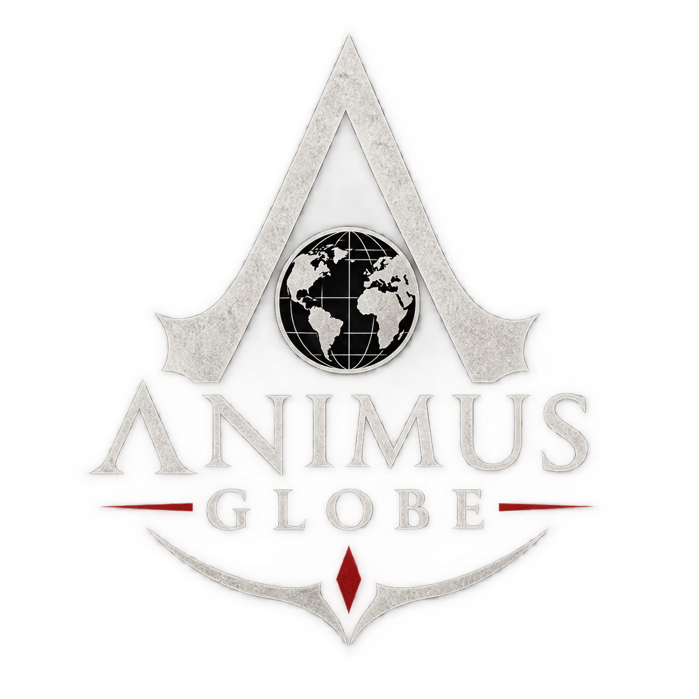

<div align="center">



## 🌍 [**Launch Animus Globe → animusglobe.pages.dev**](https://animusglobe.pages.dev)

# Animus Globe

**Explore the entire Assassin's Creed franchise on an interactive 3D globe.**

Spin the world, jump between games, and sort the series by release date, in-game chronology, era, region, protagonist, and platform.

[](https://animusglobe.pages.dev)


-success)


</div>

> **Unofficial fan project.** Not affiliated with, endorsed by, or sponsored by Ubisoft. See [Legal & Fair Use](#legal--fair-use).

---

## Table of contents

- [Features](#features)
- [How it works](#how-it-works)
- [Quick start](#quick-start)
- [Deploy to Cloudflare Pages](#deploy-to-cloudflare-pages)
- [Project structure](#project-structure)
- [Artwork](#artwork)
- [Editing the data](#editing-the-data)
- [Data accuracy](#data-accuracy)
- [Browser support](#browser-support)
- [Contributing](#contributing)
- [Legal & Fair Use](#legal--fair-use)
- [Credits](#credits)

---

## Features

### The globe
- **3D spinning globe** drawn on a canvas. It auto-rotates on the splash screen, then flies to each game's setting when you select it.
- **Country highlighting.** The countries where a game takes place light up in that game's color.
- **Interactive markers.** Tap or click any marker to open its game. Overlapping locations are spread apart so every game stays selectable.
- **Route lines.** Toggle dotted great-circle arcs that connect games in the current sort order. Sort by release date or by chronology and the series is traced across the planet.
- **Drag to spin, scroll or pinch to zoom.**

### Sort and navigate
Switch the whole side menu between five views:

| View | What it does |
|------|--------------|
| **Release** | Games in release order, grouped by year |
| **Timeline** | Games in in-game chronological order, from 431 BCE to 1918 |
| **Era** | Ancient, Medieval, Renaissance & Early Modern, Age of Sail & Revolution, Industrial Age, Modern Era |
| **Region** | Europe, Middle East, Africa, Asia, North America, Caribbean, Multi-Region |
| **Protagonist** | Games grouped by main character |

### Filters
Open **Filters** to combine any of these:

- **Show:** Main games *(default)*, Spin-offs, Handhelds, Remakes, DLC & expansions, Mobile (iOS/Android), Browser & Java phones
- **Platform:** PlayStation, Xbox, PC, Nintendo, Mobile, Java phones, VR, Browser
- **Region** and **Era**
- **Free-text search** across title, hero, and place

### Game cards
- Banner artwork for every default game, with a detail panel showing hero, setting, in-game dates, release date, era, region, platforms, and a short summary.
- **DLC nests under its base game**, so expansions like *Freedom Cry* appear right under *Black Flag*.
- Titles without artwork get a clean placeholder with a type-specific icon instead of a broken image.
- Entries whose data is not firmly confirmed carry an **approx. data** tag, so the site is honest about what it is unsure of.

### Navigation
- **Previous / Next** buttons step through the current list. The globe spins to each stop.
- **Keyboard:** `←` `→` (or `↑` `↓`) to travel, `Esc` to deselect.
- **Shareable links.** Every game has its own URL hash, for example `#bf`.

### Built to be simple
- **Mobile friendly.** The menu becomes a bottom sheet on phones, with safe-area support and touch controls.
- **No backend, no database, no build step.** Static files only.
- **Zero runtime dependencies to host.** The mapping libraries and world map data are inlined into `index.html`.

---

## How it works

Everything lives in one `index.html`:

- [`d3-geo`](https://github.com/d3/d3-geo) projects the world with an orthographic projection onto a `<canvas>`.
- [`topojson-client`](https://github.com/topojson/topojson-client) and [`world-atlas`](https://github.com/topojson/world-atlas) supply country shapes (110m resolution).
- Game data is a plain JavaScript array in the file. Filtering, sorting, grouping, and DLC nesting are all done in the browser.

Because the maps and libraries are bundled in, the site makes no network requests other than loading your own images.

---

## Quick start

No tooling is required. Any static file server will do.

```bash
git clone https://github.com/doerrhb/AnimusGlobe.git
cd AnimusGlobe

# pick one
python3 -m http.server 8000
# or
npx serve .
```

Then open <http://localhost:8000>.

> Opening `index.html` directly from disk also works, but a local server gives the most faithful result.

---

## Deploy to Cloudflare Pages

1. Push this repository to GitHub.
2. In Cloudflare, go to **Workers & Pages → Create → Pages → Connect to Git** and choose the repo.
3. Set:
   - **Framework preset:** None
   - **Build command:** *(leave empty)*
   - **Build output directory:** `/`
4. Deploy. The site is live on a `*.pages.dev` URL, and every push to `main` redeploys automatically.

It works on any static host (GitHub Pages, Netlify, Vercel, S3) in the same way.

---

## Project structure

```
AnimusGlobe/
├── index.html      # The whole app: markup, styles, script, data, inlined libraries
├── logo.png        # Splash screen logo (transparent PNG)
├── cards/          # Game banner artwork (see "Artwork")
└── README.md
```

---

## Artwork

Game banners are loaded from `cards/`. They are 460×215 (Steam header proportions) and are referenced by short filename. A name without an extension means `.jpg`.

| File | Game | File | Game |
|------|------|------|------|
| `ac1` | Assassin's Creed | `acbl.png` | Bloodlines |
| `ac2` | Assassin's Creed II | `accc` | Chronicles: China |
| `ac2d` | Assassin's Creed II: Discovery | `acci` | Chronicles: India |
| `ac3` | Assassin's Creed III | `accr` | Chronicles: Russia |
| `ac3l` | Liberation | `acfc` | Freedom Cry |
| `acac` | Altaïr's Chronicles | `acm` | Mirage |
| `acb` | Brotherhood | `acnexus` | Nexus VR |
| `acbf` | Black Flag | `aco` | Origins |
| `acbfr` | Black Flag Resynced | `acod` | Odyssey |
| `acr` | Revelations | `acro` | Rogue |
| `acs` | Syndicate | `acsh` | Shadows |
| `acu` | Unity | `acv` | Valhalla |

If an image is missing or fails to load, the card falls back to a themed placeholder automatically.

> **Note:** the artwork is **not** licensed under this repository's license. See [Legal & Fair Use](#legal--fair-use).

---

## Editing the data

Game data is the `RAW` array near the top of the `<script>` in `index.html`. Each game is one row:

```js
// [id, title, type, date, settingYear, settingLabel, hero, place, lat, lon,
//  countryIds, region, platforms, note, cover, approx]
["bf","Black Flag","main","2013-10-29",1715,"1715–1722","Edward Kenway",
 "Havana, Nassau, Kingston",23.1,-82.4,"192,388","Caribbean","PXCN",
 "Pirate Edward Kenway in the Golden Age of Piracy.","acbf"]
```

| Field | Notes |
|-------|-------|
| `type` | `main`, `spin`, `handheld`, `remake`, `dlc`, `mobile`, `java` |
| `date` | `YYYY-MM-DD`, `YYYY-MM`, `YYYY`, or `TBA` |
| `settingYear` | Number used for sorting. Negative means BCE |
| `countryIds` | Comma-separated ISO 3166-1 **numeric** codes to highlight, for example `250` for France |
| `platforms` | Letter codes: `P` PlayStation, `X` Xbox, `C` PC, `N` Nintendo, `M` Mobile, `V` VR, `B` Browser, `J` Java phones |
| `cover` | Filename in `cards/`. Leave empty for the placeholder |
| `approx` | Add `1` as the last value to show the "approx. data" tag |

To nest a DLC under its base game, add it to the `PAR` map (`{dlcId: "parentId"}`).

Default view is controlled by the `type` set in the `F` filter object (`F.type`).

---

## Data accuracy

Accuracy matters to this project. Data was cross-checked against publisher and community references, including the [Assassin's Creed Wiki](https://assassinscreed.fandom.com/), Wikipedia, and store listings, and discrepancies between sources were resolved case by case. Some deliberate choices:

- **Categories follow how the community knows each game.** *Liberation* is listed as a Handheld because it launched on PS Vita. *Freedom Cry* is DLC that later became a standalone release. *Black Flag Resynced* is a Remake.
- **Mobile and Java-phone titles are separated** from console and handheld games, and hidden by default.
- **Uncertain entries are tagged** `approx. data` instead of being presented as fact.
- Setting years show the in-game span where known. Where sources disagree (for example, *Origins*), the narrower main-story range is used.

Spotted something wrong? Please [open an issue](../../issues) with a source. Corrections are very welcome.

---

## Browser support

Any modern evergreen browser: Chrome, Edge, Firefox, Safari (desktop and iOS), and Chrome on Android. The globe uses the Canvas 2D API and CSS Grid. The side menu uses `:has()` for artwork fallbacks, available in all current major browsers.

---

## Contributing

Contributions are welcome, especially data corrections and missing entries.

1. Fork the repo and create a branch.
2. Make your change. For data fixes, include a source in the PR description.
3. Test on both a desktop and a phone-sized viewport.
4. Open a pull request.

Please keep the project dependency-free and deployable as static files.

---

## Legal & Fair Use

**Animus Globe is an unofficial, non-commercial fan project.** It is **not affiliated with, endorsed by, sponsored by, or connected to Ubisoft Entertainment** or any of its subsidiaries.

- *Assassin's Creed*, the Assassin's Creed logo, game titles, character names, and related artwork are trademarks or registered trademarks of **Ubisoft Entertainment**. All rights belong to their respective owners.
- Game banners and any related imagery are used **solely for identification, commentary, and reference** in a non-commercial, informational, and educational context about the series. This use is intended to fall under **fair use** (and equivalent doctrines such as fair dealing) because the work is transformative in presentation, non-commercial, uses low-resolution promotional images, and is not a substitute for the games themselves.
- The site contains **no game code, assets extracted from games, or copyrighted game content** beyond promotional banners and factual information such as titles, dates, platforms, and settings.
- Factual information (release dates, settings, platforms) is not subject to copyright. Summaries are original text.
- No revenue is generated from this project. Please support the official games.

This section is a good-faith statement, not legal advice.

**Takedown requests:** if you are a rights holder and want an image or entry removed, please [open an issue](../../issues) and it will be handled promptly.

The **source code** in this repository is available under the [MIT License](LICENSE). The MIT License does **not** cover Ubisoft's trademarks or any third-party artwork.

---

## Credits

- Map data: [world-atlas](https://github.com/topojson/world-atlas), derived from [Natural Earth](https://www.naturalearthdata.com/) (public domain)
- Libraries: [D3](https://d3js.org/) and [TopoJSON](https://github.com/topojson/topojson-client), both ISC licensed
- Banner proportions follow [SteamDB](https://steamdb.info/) header images
- Franchise reference data: Assassin's Creed Wiki contributors and Wikipedia editors
- Logo and project by [@doerrhb](https://github.com/doerrhb)

<div align="center">

*Nothing is true, everything is permitted.*

</div>
